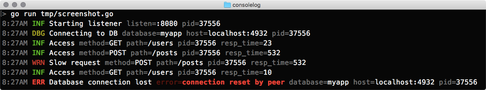

A `ConsoleWriter` for <https://github.com/rs/zerolog>.



```go
package main

import (
  "github.com/rs/zerolog"

  "github.com/karmi/consolelog"
)

func main() {
  output := consolelog.NewConsoleWriter()
  logger := zerolog.New(output).With().Timestamp().Logger()

  logger.Info().Str("foo", "bar").Msg("Hello world")

  // => 3:50PM INF Hello world foo=bar
}
```

### Custom configuration

```go
package main

import (
  "fmt"
  "strings"
  "time"

  "github.com/rs/zerolog"

  "github.com/karmi/consolelog"
)

func main() {
  output := consolelog.NewConsoleWriter(
    // Customize time formatting
    //
    func(w *consolelog.ConsoleWriter) {
      w.TimeFormat = time.Stamp
    },
    // Customize "level" formatting
    //
    func(w *consolelog.ConsoleWriter) {
      w.SetFormatter(
        zerolog.LevelFieldName,
        func(i interface{}) string { return strings.ToUpper(fmt.Sprintf("%-5s", i)) })
    },
  )

  logger := zerolog.New(output).With().Timestamp().Logger()

  logger.Info().Str("foo", "bar").Msg("Hello world")

  // => Jul 19 15:50:00 INFO  Hello world foo=bar
}
```
